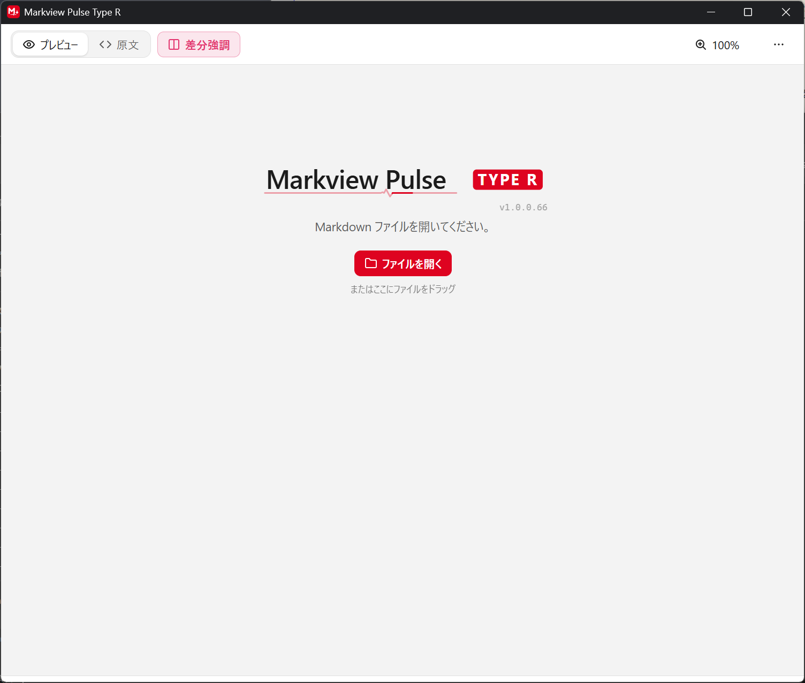
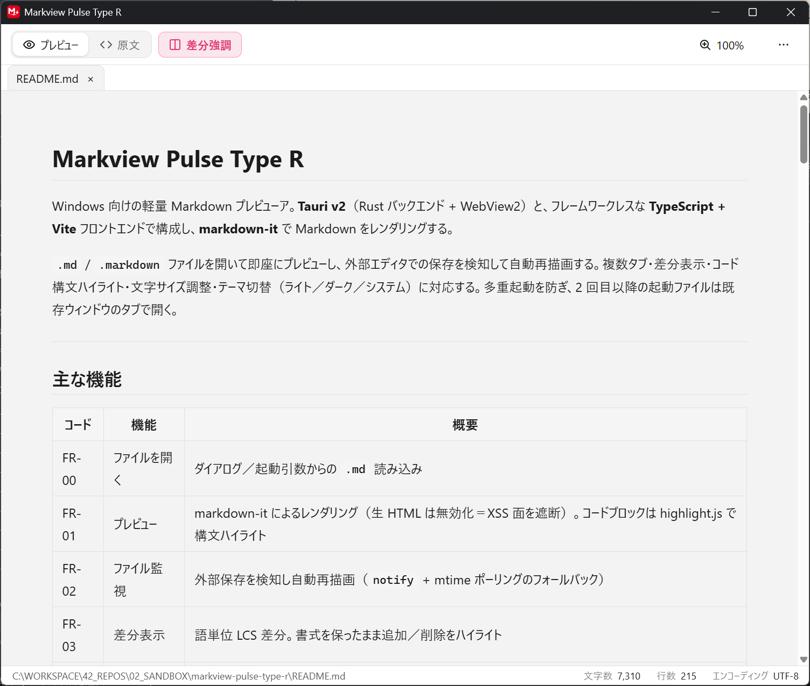

# Markview Pulse Type R

Windows 向けの軽量 Markdown プレビューア。**Tauri v2**（Rust バックエンド + WebView2）と、フレームワークレスな **TypeScript + Vite** フロントエンドで構成し、**markdown-it** で Markdown をレンダリングする。

`.md` / `.markdown` ファイルを開いて即座にプレビューし、外部エディタでの保存を検知して自動再描画する。複数タブ・差分表示・コード構文ハイライト・文字サイズ調整・テーマ切替（ライト／ダーク／システム）に対応する。多重起動を防ぎ、2 回目以降の起動ファイルは既存ウィンドウのタブで開く。

<table>
  <tr>
    <td width="50%"></td>
    <td width="50%"></td>
  </tr>
  <tr>
    <td align="center">起動画面（ファイルを開く）</td>
    <td align="center">プレビュー画面</td>
  </tr>
</table>

---

## 主な機能

| コード | 機能 | 概要 |
|---|---|---|
| FR-00 | ファイルを開く | ダイアログ／起動引数からの `.md` 読み込み |
| FR-01 | プレビュー | markdown-it によるレンダリング（生 HTML は無効化＝XSS 面を遮断）。コードブロックは highlight.js で構文ハイライト |
| FR-02 | ファイル監視 | 外部保存を検知し自動再描画（`notify` + mtime ポーリングのフォールバック） |
| FR-03 | 差分表示 | 語単位 LCS 差分。書式を保ったまま追加／削除をハイライト |
| FR-04 | タブ | 複数ファイルをタブで切り替え |
| FR-08 | テーマ | OS のライト／ダークテーマに追従。メニューからライト／ダーク／システムを手動選択も可能 |
| FR-15 | CJK 強調 | 日本語など全角テキストでの `**強調**` 表現に対応 |

### その他の機能

| 機能 | 概要 |
|---|---|
| コードハイライト | フェンス付きコードブロックを highlight.js で色付け（主要言語を登録、未登録言語はエスケープのみ）。トークン色はテーマへ追従 |
| 文字サイズ調整 | 本文（プレビュー／原文）のズーム（50〜200%）。ツールバーのボタン・**Ctrl+ホイール**・**Ctrl +/-/0** で操作（UI は等倍・非永続） |
| テーマ切替 | 「…」メニューからライト／ダーク／システムを選択（`system` は OS 追従、`light`/`dark` は固定。非永続） |
| コマンドメニュー | ツールバー右端の「…」に副次コマンド（ファイルを開く・印刷/PDF・エディタで開く・本文幅・テーマ）を集約 |
| ステータスバー | 左にファイルパス、右に文字数／行数／エンコーディング |
| 多重起動防止 | 2 回目以降の起動は既存ウィンドウへファイルを転送して前面化（`tauri-plugin-single-instance`） |
| 「送る」対応 | Windows の SendTo にショートカットを置くと、右クリック「送る」から開ける（手動設定。後述） |

非機能要件（NFR-01〜05）として起動時間・メモリ・配布サイズ等を規定する。

---

## 使い方

### ファイルを開く（FR-00）

- ツールバーの「開く」からダイアログで `.md` / `.markdown` を選択する。
- 起動引数にパスを渡すとそのまま開く。**複数のパスを渡すと各々が別タブで開く**（同一パスは複製せず既存タブをアクティブ化する）。

### プレビューと差分（FR-01 / FR-03）

- 通常モードは markdown-it でレンダリングして表示する。
- 差分モードは、**更新前の内容と現在の内容を語単位で比較**し、追加を緑・削除を赤（取消線）でハイライトする。書式を保ったまま差分を重ねる。
- 差分の基準は「外部保存などでファイルが更新される直前の内容」。開いた直後は前回内容と現在内容が同一のため、最初の更新が入るまで差分は空になる。

### 自動再描画とタブ（FR-02 / FR-04）

- 開いているファイルが外部エディタで保存されると、自動で再読込・再描画する（`notify` + mtime ポーリングのフォールバック）。
- 複数ファイルをタブで切り替えられる。
- 同じファイルを再度開こうとしたとき、また**アプリ起動中に「送る」やファイル関連付けから別ファイルを渡したとき**は、新しいウィンドウを開かず既存ウィンドウのタブで開く（多重起動防止）。

### 文字サイズ（ズーム）

- 本文（プレビュー／原文）のみを 50〜200% で拡縮する（ツールバーや UI は等倍のまま）。
- 操作: 「…」メニュー外のツールバー上にある倍率ボタン、**Ctrl+マウスホイール**、**Ctrl + `+` / `-` / `0`（リセット）**。
- 倍率は永続化しない（再起動で 100% に戻る）。

### テーマ切替

- ツールバー右端の「…」メニュー最下部で **ライト／ダーク／システム** を選択する。
- `システム` は OS テーマに追従、`ライト`/`ダーク` は固定適用する。起動引数 `--theme` の指定が初期値となる。選択は永続化しない。

### コマンドメニュー（「…」）

- ツールバー右端の「…」をクリックすると、**ファイルを開く／印刷・PDF／エディタで開く／本文幅／テーマ** が開く。
- メニュー外のクリックまたは `Esc` で閉じる。

### Windows「送る」からの起動（手動設定）

アプリは起動引数の `.md` を開けるため、SendTo にショートカットを置くだけで「送る」から利用できる。

1. `npm run tauri build` で `src-tauri/target/release/mviewr.exe` を生成する。
2. `Win+R` → `shell:sendto` を実行（`%APPDATA%\Microsoft\Windows\SendTo` が開く）。
3. そのフォルダ内に `mviewr.exe` へのショートカットを作成する（名前は任意、例「Markview Pulse Type R」）。

以降、`.md` を右クリック →「送る」→ 作成したショートカットで開ける。アプリ起動中なら既存ウィンドウのタブで開く。

---

## 動作要件

- **OS**: Windows 11
- **ランタイム**: WebView2（Windows 11 は標準同梱。配布物には未同梱のため、未導入環境では別途インストールが必要）

### 開発要件

- **Node.js**（開発・ビルドは新しめの LTS で可。ただし **E2E は Node 22 が前提** — 後述）
- **Rust** ツールチェイン（stable）+ Cargo
- **Tauri v2** の前提（[Tauri 公式の前提条件](https://tauri.app/start/prerequisites/) を参照）

---

## セットアップ

```bash
# 依存関係のインストール
npm install
```

## 開発・ビルド

リポジトリ直下で実行する。

| タスク | コマンド |
|---|---|
| 開発サーバ（Vite, port 1420） | `npm run dev` |
| 型チェック + フロントビルド | `npm run build`（`tsc && vite build`） |
| デスクトップアプリ起動（開発） | `npm run tauri dev` |
| 実行ファイル（単一 exe）のビルド | `npm run tauri build` |

`npm run tauri build` で単一の実行ファイル `mviewr.exe`（実測サイズ約 6MB、`[profile.release]` 最適化適用後）を `src-tauri/target/release/` に生成する。インストール不要のポータブル exe として配布できる（`bundle.active = false` によりインストーラ MSI / NSIS は生成しない）。WebView2 ランタイムは同梱せず、OS の Evergreen を前提とする。

---

## テスト

| 種別 | コマンド |
|---|---|
| 単体テスト（Vitest） | `npm test` / ウォッチ: `npm run test:watch` |
| 単一ファイル | `npx vitest run tests/core/diffEngine.test.ts` |
| 名前で単一テスト | `npx vitest run -t "merges consecutive ops"` |
| カバレッジ（`src/core` に 80% ゲート） | `npm run coverage` |
| ベンチマーク | `npm run bench` |
| Lint / 自動修正 | `npm run lint` / `npm run lint:fix` |
| フォーマット / 検査 | `npm run format` / `npm run format:check` |

### Rust バックエンド

`src-tauri/` で実行する。

```bash
cargo test                      # 単体テスト
cargo fmt                       # フォーマット
cargo clippy -- -D warnings     # Lint
```

### E2E テスト

`npm run test:e2e` は **実機の WebView2 バイナリ**を WebdriverIO + `tauri-driver` で駆動する（Playwright ではない）。前提は自動構築されず、環境側で用意する必要がある。

- `cargo install tauri-driver`
- WebView2 とバージョン一致の `msedgedriver.exe`（安定したパスへ配置）
- ビルド済みアプリ
- 環境変数 `TAURI_APP_PATH` / `TAURI_NATIVE_DRIVER`
- **Node 22 で実行**（WebdriverIO 9 は新しすぎる Node で動作しない既知の問題があるため `volta run --node 22 npm run test:e2e` 等で固定）

スペックの型チェックは `npm run typecheck:e2e`。詳細は `wdio.conf.ts` 冒頭のコメントを参照。

---

## アーキテクチャ

3 層構成。**純粋ロジックは DOM・Tauri・I/O から独立させ、単体テスト可能に保つ**ことを設計の原則とする。

### フロントエンド（`src/`）

- `main.ts` — 合成ルート。可変状態（`TabState`）と副作用（IPC・DOM 配線）を集約する唯一の場所。`core/` の純関数で新しい不変状態を生成して再描画する。
- `src/core/` — フレームワーク非依存の純粋ロジック:
  - `tabs/tabStore.ts` — 不変な `TabState` 遷移
  - `markdown.ts` — markdown-it 設定（`html: false` で生 HTML を無効化）＋ highlight.js による構文ハイライト（主要言語のみ登録）
  - `diff/diffEngine.ts` — 語単位 LCS 差分（`O(n*m)`）／ `diff/diffDom.ts` — DOM への描画
  - `theme/themeController.ts` — OS テーマ追従と実行時切替（`createThemeController`／`ThemeSource` 抽象を注入）
  - `view/contentWidth.ts` — 本文幅プリセット／ `view/zoomLevel.ts` — 本文ズーム段階（純関数）
  - `fs/fileClient.ts` — IPC ブリッジ
- `src/ui/` — `tabBar.ts` / `preview.ts` / `toolbar.ts` / `statusBar.ts` / `overflowMenu.ts`。状態とコールバックで駆動する純描画・DOM 配線関数。

### バックエンド（`src-tauri/src/`）

- `lib.rs` — Tauri アプリ構築。`single-instance`（最初に登録）・dialog・opener の各プラグイン、`WatchManager` 管理状態、5 コマンドを登録。2 回目以降の起動は single-instance のコールバックで捕捉し、起動引数の `.md` を `open-files` イベントで既存ウィンドウへ転送して前面化する。
- `commands/` — `file.rs`（ファイル読込）/ `watcher.rs`（監視の開始・停止）/ `cli.rs`（起動引数からの `.md` 抽出・テーマ抽出）
- `watcher/mod.rs` — `notify` による FS イベント監視と mtime ポーリングのフォールバック（150ms デバウンス）。`ChangeEmitter` トレイトで Tauri と疎結合。
- `error.rs` — `AppError`（`thiserror`）。日本語メッセージ。`Serialize` は Display 文字列のみを出力。

### IPC コントラクト

- `invoke` は **camelCase** のキー（`tabId`）で呼び、Tauri が Rust の **snake_case**（`tab_id`）へマップする。Rust のレスポンス構造体は `#[serde(rename_all = "camelCase")]`。
- `file-changed` / `watch-error` イベントは id・パス・メッセージのみを運び、ファイル内容は載せない。フロントが通知を受けて再読込する。`open-files` イベント（single-instance 経由）はパス配列のみを運び、フロントが各々をタブで開く。
- Rust→JS のペイロードは `fileClient.ts` の **Zod** スキーマで境界検証する。ペイロード変更時は Rust 構造体と Zod スキーマの両方を必ず同期させる。

---

## セキュリティ

- 信頼できない `.md` を前提とし、markdown-it は `html: false` で生 HTML を無効化。
- CSP は `src-tauri/tauri.conf.json` に設定（`script-src 'self'`、`object-src 'none'` 等）。
- capability は `src-tauri/capabilities/default.json` で最小権限。
- ファイルは読み取り専用。秘匿情報・外部送信はなし。

---

## ライセンス

[MIT License](LICENSE) で公開。Copyright (c) 2026 Markview Pulse Type R contributors

利用している第三者ライブラリはすべて寛容型ライセンス（MIT / Apache-2.0 / BSD / ISC / MPL-2.0 等）で、ソース公開を強制するコピーレフト条項は含まない。再配布時は各ライブラリの著作権表示（attribution）を同梱すること。

---

## 謝辞

本アプリは、[**Markview Pulse**](https://github.com/beex-okamura/markview-pulse)（作者: beex-okamura）へ敬意を込めて再実装したクローンである。機能・思想（リアルタイムプレビュー、単一 exe でのポータブル動作、外観テーマ追従など）はオリジナルを踏襲しつつ、実装を Rust + Tauri v2 で独自に再構築している。

優れた着想を与えてくれたオリジナルの作者と、その公開に感謝する。なお本プロジェクトはオリジナルとは独立した実装であり、オリジナルの作者・プロジェクトによる承認・関与を受けたものではない。
